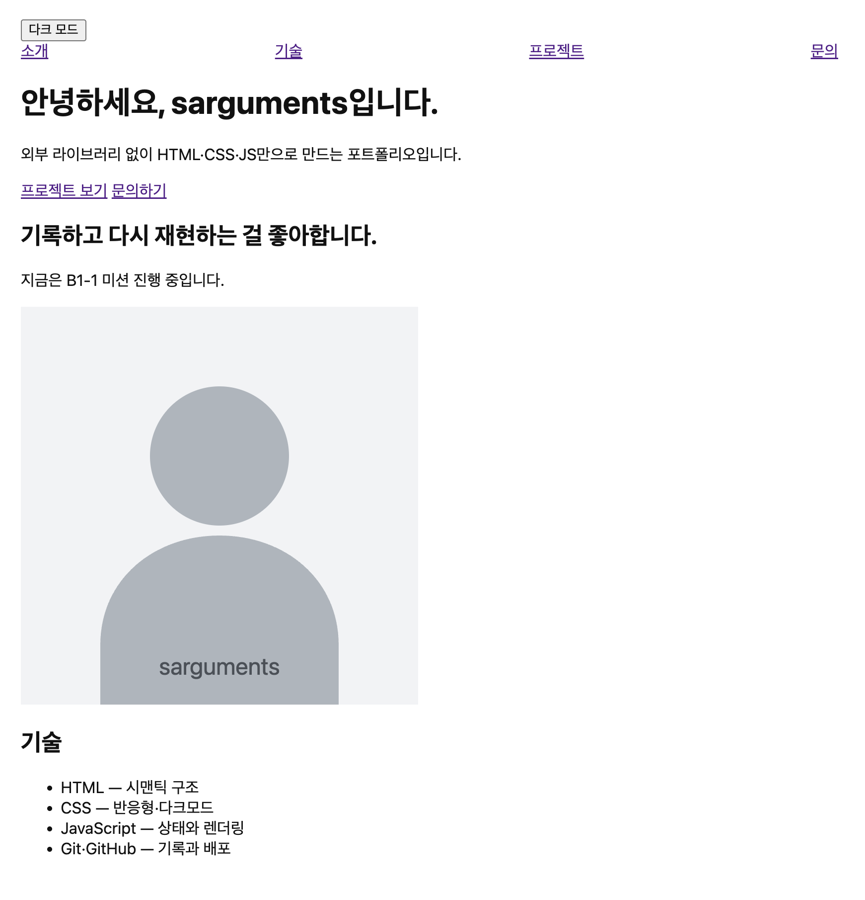
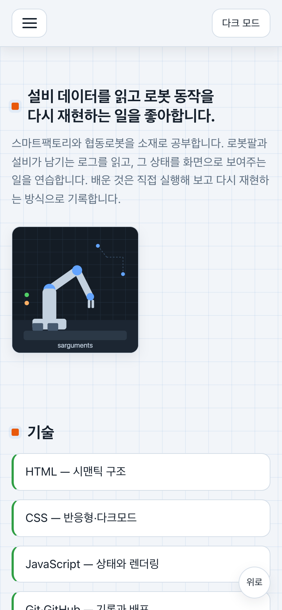
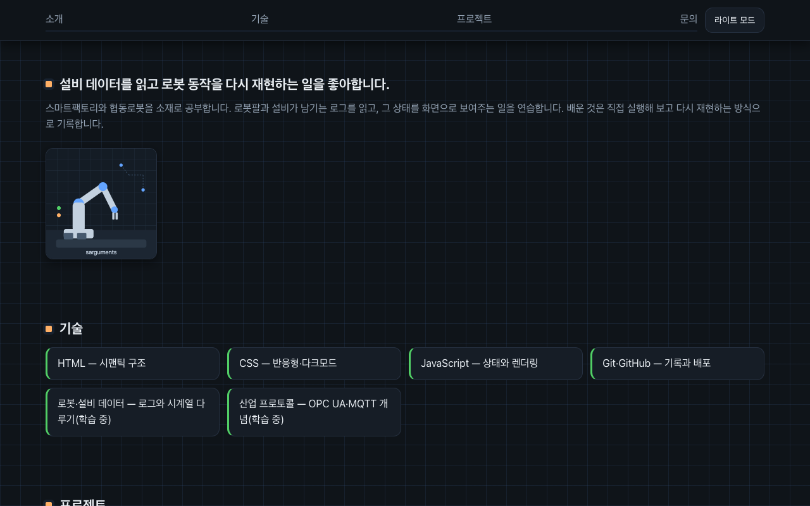

# B1-1 포트폴리오

나를 소개하는 반응형 웹페이지. 외부 라이브러리 없이 HTML·CSS·JavaScript만으로 만든다.

## 설계 기록

- 접근성: 스킵링크·`aria-expanded`·`aria-describedby`·`role=status/alert`로 키보드·스크린리더 흐름을 챙긴다.
- 상태 관리: 화면을 결정하는 값은 `STATE` 한 곳에 모으고 `setState`로만 바꾼다. 추적은 조건부 디버그 로그로 한다.
- 견고성: 테마 저장은 try/catch, 목록 요청은 8초 타임아웃+수동 재시도, 외부 데이터는 이스케이프 후 삽입한다.
- 금지 준수: `var`·인라인 이벤트·인라인 스타일·외부 라이브러리 없음.

## 구조

- `index.html` — 페이지 뼈대
- `css/style.css` — 변수와 기본 스타일
- `js/main.js` — 동작 진입점
- `images/` — 이미지 보관
- `presentation/` — 이해용 강의 슬라이드(단일 `index.html`, 외부 라이브러리 없음)
- 배포 파일: GitHub Pages는 추가 파일이 필요 없고 루트 `index.html` 기준으로 서빙한다. `CNAME`은 커스텀 도메인을 연결할 때만 추가한다.

## 학습 자료

- `presentation/index.html`을 브라우저로 열면 이해용 강의가 나온다. 방향키·스페이스로 넘긴다.
- 미션 평가 대상이 아니라 개념 이해용 보조 자료다. 원문 금지를 그대로 지켜서 외부 라이브러리·`var`·인라인 이벤트·인라인 스타일을 쓰지 않았다.
- 흐름도(`.flow`)는 큰 글자로, 구조·상태·fetch·반응형은 SVG 다이어그램으로 넣었다.

## 실행

1. 이 폴더를 VS Code로 연다.
2. Live Server로 `index.html`을 연다.
3. 5구역·테마 전환·메뉴·스크롤·등장·저장소 목록·폼 검증을 확인한다.

## 기술

### 동작 확인

- 반응형: 360px 모바일 카드 1열+햄버거, 768px 태블릿 내비 펼침+카드 2열, 1024px 데스크톱 최대폭 1024px 중앙+카드 4열. 버튼·카드는 `hover`+`transition`, 입체감은 `box-shadow`. 아래 스크린샷 참고.
- 테마: 토글이 다크·라이트를 바꾸고 `localStorage`에 저장해 새로고침 후 복원한다. 저장은 try/catch, 그리기는 `<head>` 선주입으로 번쩍임 방지.
- 메뉴·스크롤: 햄버거 토글(`aria-expanded` 동기화), `IntersectionObserver` 등장(임계값 0.2), 300px에서 맨 위로 버튼, 60px에서 내비 표시 변경.
- 목록: `fetch`+`async/await`+`try/catch`로 로딩·성공·빈 결과·오류를 나눈다. 실패는 수동 다시 시도 버튼+8초 타임아웃, 캐싱은 없다.
- 폼: 빈값·이메일 형식 검사를 제출 시점에 하고 오류는 연결된 자리(`aria-describedby`)+`role=alert`에 표시, 입력하면 지운다.

### 분리·선택 이유

- 파일: 구조·표현·동작을 `index.html`·`css/style.css`·`js/main.js`로 나눈다.
- 시맨틱: 5구역(`header`·`nav`·`main`·`section`·`article`·`footer`), 앵커 5개, `label for=id`, `alt` 한 줄.
- 변수: 색·간격 값을 `:root`에 모아 다크모드는 같은 이름 덮어쓰기로 전환한다.
- 이벤트: `onclick` 대신 `addEventListener`로 연결하고 `var`를 쓰지 않는다.

### 코드 흐름 추적

- 상태→렌더: 이벤트가 `STATE`를 바꾸고 적용 함수가 그린다. 5흐름은 테마·메뉴·위로·목록·폼.
- 비동기: `fetch`는 망 단절 때만 실패해서 `response.ok` 검사가 필수. 403 한도·404 없음으로 나눈다.
- 목록 변환: `filter`로 언어 선별 → `map`으로 카드 HTML 변환 → `forEach`로 삽입. 외부 데이터는 이스케이프 후 삽입.
- 레이아웃: 내비는 가로 한 줄 1차원이라 Flex(`space-between`), 카드 격자는 행·열 2차원이라 Grid(`auto-fit minmax`). 카드가 적어도 `auto-fit`이 폭을 채운다.

### 설계 판단

- `STATE`: 화면을 결정하는 값을 한 객체에 모아 `setState`로만 바꾼다. 추적은 조건부 디버그 로그.
- 모바일 퍼스트: 좁은 화면을 기본으로 쓰고 `min-width` 미디어쿼리로 넓혀 간다. 저사양·터치 우선.
- 기준값: 스크롤탑 300px·내비 변경 60px·등장 임계값 0.2. 바꾸면 이 줄을 고친다.

### 낯선 개념

- 스킵링크: 키보드·스크린리더 사용자가 내비를 Tab으로 다 넘기지 않고 본문으로 바로 건너뛰는 링크. 평소엔 화면 밖에 숨기고 Tab 포커스가 오면 나타난다.
- STATE: 화면을 결정하는 값을 한 객체에 모은 것. 이벤트는 값만 바꾸고 그리기(적용 함수)가 따로라서 흐름 추적이 쉽다. `setState`로만 바꾸는 규칙이며, 추적은 `__B11_DEBUG`가 켜져 있을 때만 찍힌다.
- 미디어쿼리·모바일 퍼스트: 화면 너비 조건(`min-width`)에 따라 다른 스타일을 덧입히는 분기. 좁은 화면을 기본으로 쓰고 넓어질 때 덮어써서 저사양·터치 환경이 먼저 보장된다. 이 페이지는 768px·1024px 두 번 갈아입는다.
- `defer`: HTML 해석을 막지 않고 스크립트를 받아 해석이 끝난 뒤 순서대로 실행하는 속성. 해석 전에 실행되는 `async`와 달리 DOM이 준비된 상태가 보장된다.
- 임계값 0.2: 감시 대상이 화면에 20% 들어오면 등장 콜백이 실행되는 비율. 0이면 닿자마자, 1이면 전부 보여야 실행된다. 한 번 보이면 감시를 그만둔다(`unobserve`).
- FOUC: 스타일이 붙기 전 흰 화면이 번쩍이는 현상. `<head>` 동기 스크립트로 저장된 테마를 그리기 전에 먼저 박아 막는다.
- `auto-fit`: Grid 빈칸을 접어 카드를 늘리는 방식. 반대로 `auto-fill`은 빈칸을 유지해 카드가 한쪽으로 쏠린다.
- `response.ok`: `fetch`는 404·403에도 실패하지 않아서 200~299 여부를 직접 검사한다. 망 단절 때만 `catch`로 간다. 403은 시간당 60회 한도 초과, 404는 사용자 없음으로 나눈다.
- `__B11_DEBUG`: 상태 변경 로그를 켜는 전역 스위치. 평소엔 꺼져 있어 로그가 없고, 콘솔에 `window.__B11_DEBUG = true`를 치면 그 뒤부터 바뀐 상태가 찍힌다. `B11`은 B1-1 접두어다.

## 배포

- 배포 URL: https://sarguments.github.io/b1-1-portfolio/
- 저장소: https://github.com/sarguments/b1-1-portfolio

## 스크린샷

| 데스크톱 | 모바일 | 다크모드 |
| --- | --- | --- |
|  |  |  |
